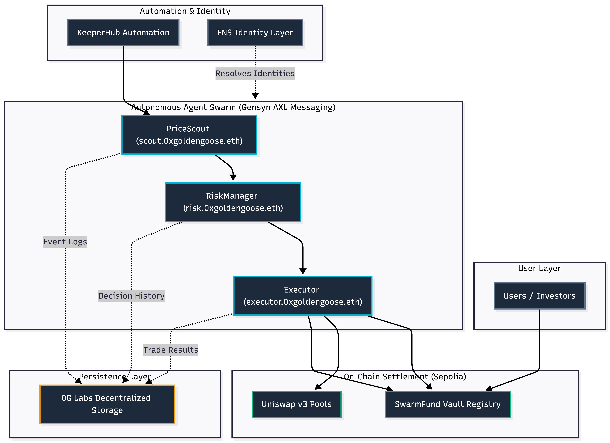

# 0x Golden Goose

> AI-powered multi-agent DEX trading swarm built for ETHGlobal OpenAgents

0x Golden Goose is an autonomous trading system made of three specialized AI agents that coordinate with each other to monitor, evaluate, and execute trades on Uniswap v3 — without any central server or single point of failure.

---

## Architecture



---

## Prize Tracks

| Sponsor | Prize | How 0x Golden Goose qualifies |
|---|---|---|
| **0G Labs** | Best Agent Framework ($7,500) | Multi-agent framework built on 0G — state, coordination, swarm architecture |
| **0G Labs** | Best Autonomous Agents/Swarms ($7,500) | Three autonomous agents in a swarm — PriceScout → RiskManager → Executor |
| **Uniswap Foundation** | Best Uniswap API Integration ($5,000) | Live Uniswap v3 QuoterV2 + SwapRouter02 integration for quotes and execution |
| **ENS** | Best ENS Integration for AI Agents ($2,500) | Each agent has an ENS identity; tokens and protocols resolved by ENS name |
| **ENS** | Most Creative Use of ENS ($2,500) | AI agents as ENS-identified autonomous actors — a new paradigm for onchain AI |
| **KeeperHub** | Best Use of KeeperHub ($4,500) | KeeperHub schedules PriceScout + triggers on price condition deviation |
| **Gensyn** | Best Application of AXL ($5,000) | All three agents communicate exclusively over Gensyn AXL P2P messaging |

---

## Quick Start

### Prerequisites

- **Node.js**: 18+ (Vite + modern TypeScript)
- **npm**: comes with Node
- **Firebase CLI** (for deploy): `npm i -g firebase-tools`
- **ngrok** (for remote access): `npx ngrok http 3001`
- **Gensyn AXL node** (optional — local-bus fallback works without it)

### 1. Install

```bash
git clone https://github.com/cryptotwilight/0x-golden-goose
cd 0x-golden-goose
npm install
cp .env.example .env
```

### 2. Configure

Edit `.env`:

```bash
# At minimum, set your RPC URL (no wallet needed for simulate mode)
MAINNET_RPC_URL=https://eth.llamarpc.com

# Set for live trading on Sepolia
PRIVATE_KEY=0x...
KEEPERHUB_API_KEY=kh_...
```

### 3. Run the Core Service

```bash
npm run dev
```

The live terminal dashboard boots immediately and shows all three agents. In **simulate mode** (no `PRIVATE_KEY`), no real transactions are sent.

**Core service endpoints:**

| Endpoint | Method | Description |
|---|---|---|
| `/api/stats` | GET | Live agent stats (JSON) — what the Web UI polls |
| `/api/settings` | POST | Update scout tick window and thresholds |
| `/api/trigger` | POST | KeeperHub callback (triggers a scout tick) |

**Local health check:**

```powershell
Invoke-WebRequest -Uri "http://127.0.0.1:3001/api/stats" -UseBasicParsing -TimeoutSec 5
```

### 4. Run the Web UI (Development)

0x Golden Goose includes a premium React Web UI dashboard built with Vite.

```bash
cd ui
npm install
npm run dev
```

Open `http://localhost:5173` in your browser. The UI defaults to `http://127.0.0.1:3001` when running locally. You can change the API base URL in the header field.

See [UI README](./ui/README.md) for deployment details.

### 5. Connect Hosted Firebase UI to Your Local Service

The Firebase deployment serves the UI at `https://x-golden-goose.web.app/`. Firebase Hosting serves **only** the static UI — the core agents/API must still be running.

1. Start the core service locally (Step 3) on port 3001
2. Expose port 3001:
   ```bash
   npx ngrok http 3001
   ```
3. Copy the ngrok **https** URL (e.g. `https://xxxx.ngrok-free.app`) and paste it into the UI's **API URL** field (no path, no trailing slash)
4. Verify: `https://xxxx.ngrok-free.app/api/stats` should return JSON

> **Tip:** If you see an ngrok browser warning page, the UI sends `ngrok-skip-browser-warning: true`, but you can also click through once in the browser.

### 6. Set Up KeeperHub Automation

The recommended path is via the KeeperHub MCP plugin:

```bash
claude mcp add --transport http keeperhub https://app.keeperhub.com/mcp
```

Then expose port 3001 publicly:

```bash
npx ngrok http 3001
```

Create two workflows:
1. **Scheduled poll** (cron `* * * * *`) that `POST`s to `https://your-ngrok-url/api/trigger` with body `{"source":"keeperhub","event":"poll_prices"}`
2. **Price alert** for WETH/USDC ±1.5% posting to the same URL

**Alternative — setup script:**

```bash
# Linux/macOS
CALLBACK_URL=https://your-ngrok-url.ngrok-free.app/api/trigger npm run setup-keeper

# Windows PowerShell
$env:CALLBACK_URL = "https://your-ngrok-url.ngrok-free.app/api/trigger"
npm run setup-keeper
```

---

## Agent Roles

### PriceScout (`scout.0xgoldengoose.eth`)

Fetches live WETH/USDC prices from Uniswap v3 on Ethereum mainnet using the QuoterV2 contract. Computes a 5-tick rolling average and emits `BUY` signals when the price drops more than `BUY_THRESHOLD_PCT` below the average, and `SELL` signals when it rises above `SELL_THRESHOLD_PCT`. All signals are forwarded to the RiskManager via Gensyn AXL and logged to 0G storage.

### RiskManager (`risk.0xgoldengoose.eth`)

Receives signals from PriceScout and applies three risk rules before approving:
- **Confidence gate**: rejects signals with confidence < 40%
- **Circuit breaker**: rejects moves > 10% (possible flash crash)
- **Cooldown**: enforces 60s between approved trades

Approved decisions include an adjusted trade size scaled by confidence and a computed risk score (0–10).

### Executor (`executor.0xgoldengoose.eth`)

Receives approved decisions from RiskManager and manages the trade lifecycle. In **LIVE** mode, it interacts with the **SwarmFund** registry to draw down user funds, executes the swap on Uniswap v3 (Sepolia), and returns the resulting tokens to the vault. It handles ERC20 approvals, transaction monitoring, and gas optimization. Results are broadcast back and stored on 0G.

---

## Gensyn AXL Setup

AXL is a P2P encrypted node that gives each agent its own network identity. Agents send messages to each other using their peer IDs via:

- `POST /send` with `X-Destination-Peer-Id` header — fire-and-forget
- `GET /recv` — poll for inbound messages
- Messages are encrypted end-to-end using Yggdrasil

0x Golden Goose includes a graceful fallback: when AXL isn't reachable, agents communicate via a **local EventEmitter** (the dashboard shows `local-bus`). KeeperHub availability does **not** affect this indicator — it is purely about AXL connectivity.

**Run AXL locally:**

```bash
git clone https://github.com/gensyn-ai/axl
cd axl && make build
openssl genpkey -algorithm ed25519 -out private.pem
./node -config node-config.json
```

**Point your `.env` at the node:**

```bash
AXL_API_URL=http://127.0.0.1:9002
```

---

## 0G Persistence

Each agent writes JSON state snapshots and event logs to the 0G decentralized storage network via the `@0glabs/0g-ts-sdk`. Files are content-addressed by their merkle root hash, creating an immutable audit trail.

| Agent | Stores |
|---|---|
| PriceScout | Price ticks, emitted signals |
| RiskManager | Decision history with reasons and risk scores |
| Executor | Trade results with tx hashes and gas costs |

**Notes:**
- If `@0glabs/0g-ts-sdk` is missing, the agents will run but log that 0G is disabled
- Uploads are disabled if `PRIVATE_KEY` is not set (simulate-friendly)

---

## Environment Variables

| Variable | Default | Description |
|---|---|---|
| `PRIVATE_KEY` | — | Executor wallet key (Sepolia only) |
| `MAINNET_RPC_URL` | llamarpc | For price quotes |
| `SEPOLIA_RPC_URL` | ankr | For trade execution |
| `OG_INDEXER_URL` | 0G testnet | 0G storage indexer |
| `OG_RPC_URL` | — | 0G RPC endpoint |
| `AXL_API_URL` | localhost:9002 | Gensyn AXL node |
| `KEEPERHUB_API_KEY` | — | KeeperHub automation key |
| `KEEPERHUB_API_URL` | app.keeperhub.com/api | KeeperHub REST API base URL |
| `ENS_SCOUT_NAME` | scout.0xgoldengoose.eth | ENS name for PriceScout |
| `ENS_RISK_NAME` | risk.0xgoldengoose.eth | ENS name for RiskManager |
| `ENS_EXECUTOR_NAME` | executor.0xgoldengoose.eth | ENS name for Executor |
| `TOKEN_IN` | WETH | Input token symbol |
| `TOKEN_OUT` | USDC | Output token symbol |
| `POOL_FEE` | 500 | Pool fee tier in bps (500 = 0.05%, 3000 = 0.3%, 10000 = 1%) |
| `TRADE_AMOUNT_WEI` | 0.1 ETH | Amount in wei per trade signal |
| `BUY_THRESHOLD_PCT` | 1.5 | % drop to trigger BUY |
| `SELL_THRESHOLD_PCT` | 1.5 | % rise to trigger SELL |
| `MAX_SLIPPAGE_PCT` | 0.5 | Max swap slippage |
| `SCOUT_POLL_MS` | 15000 | Price poll interval |
| `FUND_CONTRACT_ADDRESS` | — | SwarmFund registry address |
| `FUND_OWNER_ADDRESS` | — | Specific vault to manage (optional) |

---

## Tech Stack

- **TypeScript** — full type safety across all agents
- **viem** — Ethereum/ENS interaction
- **ethers** — smart contract interaction
- **@0glabs/0g-ts-sdk** — decentralized agent state storage
- **Gensyn AXL** — P2P encrypted inter-agent messaging
- **KeeperHub** — automation and scheduling layer (integrated via MCP)
- **Uniswap v3** — QuoterV2 (prices) + SwapRouter02 (execution)
- **ENS** — agent identity and address resolution
- **React + Vite + wagmi** — Web UI with wallet integration
- **Firebase Hosting** — static UI deployment
- **Solidity 0.8.20** — SwarmFund multi-user vault contract

---

## SwarmFund Smart Contract

The custom `SwarmFund` contract enables multi-user isolated vaults:

- Each user has a fully isolated vault — no cross-user fund access
- Per-vault bot wallet authorization (not global)
- Per-token trade limits to cap drawdown risk
- `drawdown()` and `returnFunds()` for the bot trade lifecycle
- `harvestableAmount()` to query withdrawable profits

Deploy with: `npx tsx scripts/deploy-fund.ts`

---

## FAQ & Troubleshooting

See [FAQ_README.md](./FAQ_README.md) for common issues and tips.

### Quick Fixes

| Issue | Fix |
|---|---|
| UI says OFFLINE | Check `GET http://127.0.0.1:3001/api/stats` returns JSON |
| ngrok interstitial | Open the URL once in browser and click through |
| Dashboard shows "local-bus" | AXL node isn't running — set `AXL_API_URL` correctly |
| Wallet errors | Disable conflicting wallet extensions (TronLink + MetaMask) |
| "Not authorized bot for this vault" | Set the Authorized Bot Wallet in the UI's SwarmFund Settings tab |
| "Insufficient vault balance" | Deposit more tokens via the UI's Deposit tab |

---

## Developer Experience Feedback

See [FEEDBACK.md](./FEEDBACK.md) for honest feedback on integrating with Gensyn AXL, 0G Labs, Uniswap v3, ENS, KeeperHub, and SwarmFund during the hackathon.

---

Built for [ETHGlobal OpenAgents](https://ethglobal.com/events/openagents) — May 2026
