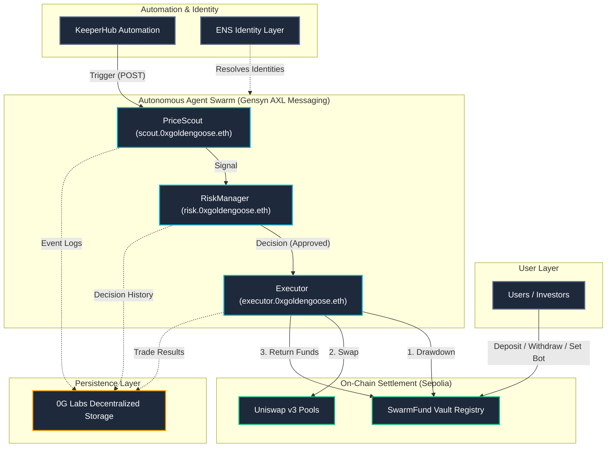

```mermaid
graph TD
    subgraph Users["User Layer"]
        U[Users / Investors]
    end

    subgraph Automation["Automation & Identity"]
        KH[KeeperHub Automation]
        ENS[ENS Identity Layer]
    end

    subgraph Agents["Autonomous Agent Swarm (Gensyn AXL Messaging)"]
        PS["PriceScout (scout.0xgoldengoose.eth)"]
        RM["RiskManager (risk.0xgoldengoose.eth)"]
        EX["Executor (executor.0xgoldengoose.eth)"]
    end

    subgraph Storage["Persistence Layer"]
        OG[0G Labs Decentralized Storage]
    end

    subgraph Settlement["On-Chain Settlement (Sepolia)"]
        SF[SwarmFund Vault Registry]
        UNI[Uniswap v3 Pools]
    end

    U -- "Deposit / Withdraw / Set Bot" --> SF
    KH -- "Trigger (POST)" --> PS
    PS -- "Signal" --> RM
    RM -- "Decision (Approved)" --> EX
    
    EX -- "1. Drawdown" --> SF
    EX -- "2. Swap" --> UNI
    EX -- "3. Return Funds" --> SF
    
    PS -. "Event Logs" .-> OG
    RM -. "Decision History" .-> OG
    EX -. "Trade Results" .-> OG

    ENS -. "Resolves Identities" .-> Agents

    classDef agent fill:#1e293b,stroke:#06b6d4,stroke-width:2px,color:#fff;
    classDef storage fill:#1e293b,stroke:#f59e0b,stroke-width:2px,color:#fff;
    classDef settlement fill:#1e293b,stroke:#10b981,stroke-width:2px,color:#fff;
    classDef external fill:#1e293b,stroke:#64748b,stroke-width:2px,color:#fff;
    
    class PS,RM,EX agent;
    class OG storage;
    class SF,UNI settlement;
    class KH,ENS,U external;
```
